# 1701QCA Final project journal: Yuki Takahata S5186392 #

<!--- As for other assessments, fill out the following journal sections with information relevant to your project. --->

<!--- Markdown reference: https://guides.github.com/features/mastering-markdown/ --->

### 1.Bop it ###

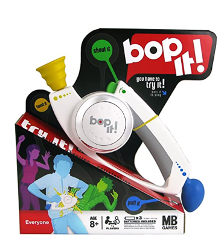
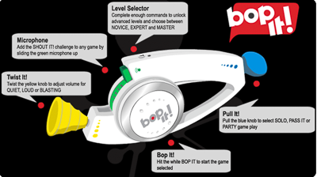

 
[How to play Bop it] *https://youtu.be/ayBmsWKqdnc* 
*This project is related to mine because my project is "musical instrument which react to physical movement". "Bop it" is a classic interactive party toy. All new Bop It calls out commands, the player reacts fast.  It is a game in which sound and body movements linked closely. 
ex;
"Bop It!" becomes the sound of a bass drum.
"Spin It!" becomes the sound of a wobbling wheel.
"Flick It!" becomes a "Boing!" sound.
"Pull It!" becomes the sound of a slide-whistle.
"Twist It!" becomes a cranking sound.
"Shout It!" becomes a DJ's scratching sound.*
 
### 2.Gym ball cover sewing project ###

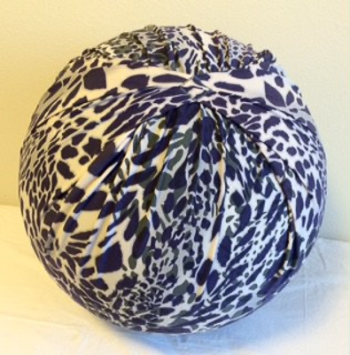
 
*This project is related to mine because this gave me the idea of fabrication. Initially, it seemed impossible to attach the microbit device on the gym ball. After this finding, it became  worth giving it a try with a project.* 
[How to make yoga ball cover]  https://www.newlittlelife.com/2016/03/12/diy-birth-ball-cover/
 

### 3.Failylight ballon ###

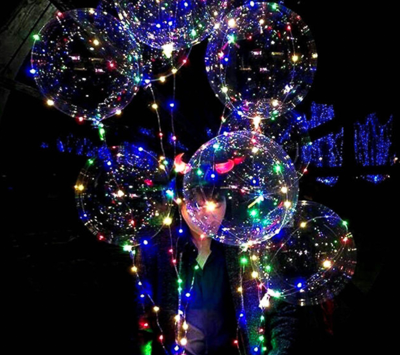
 
This project is related to mine because lighten up the ball is another feature. This product is a general consumer product and, pretty popular.
### 4.LED bouncie  ###
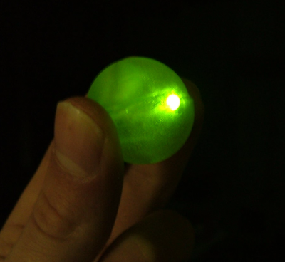
 
 This project is related to mine because, if the light turns on accordant with the ball's movement is perfect.
   
[how to make bouncy ball] *https://www.instructables.com/id/LED-Bouncie/*
 

### 5.Shader-based Physical Modelling Synthesis ###
 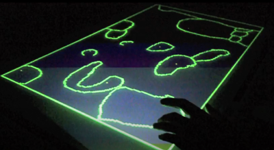
  
   *This project is very similar to my conceptual design1. However, it is very structured and developed with modern technologies.*
    [link to the artickle]*http://www.nime.org/proceedings/2017/nime2017_paper0028.pdf* 
  
### 6.Device orchestra ###

 
 
  [divice orchestra]*https://youtu.be/8jDROj236R4* 
  *This project achieved fun of interactive technologies and music. It is amusing to watch.*

## Other research ##

1.How to soldering
https://www.instructables.com/id/How-to-solder/
I was considering to add vibration,  touch sensor and LEDs from Kmart. In order to attach these to my microbit, I tried to soldering.. however it failed.

2. sewable ploject
https://learn.adafruit.com/flora-rgb-smart-pixels
I was thinking to attach this part and sewing them on around the ball.

## Conceptual development ##

### Design intent ###
The gym ball makes your daily exercise more fun! 

### Design ideation ###
## Design concept 1 /Experiment with the relations of SOUNDS & MATERIAL ##
 
Experiment on how humans react when abnormally occurs in the relations between senses of touching , hearing and sight.
Embark the sense of wonder which we normally don't care. 

When you touch gravel> it sounds you knock the  wood.
When you touch the sand> it sounds you mix the gravels. etc..  

 
 

## Design concept 2 /Musical Gym ball ##

Gym ball plays music and rhythm which synthesize with your movement! 

  
 
 ## Design concept 3/ Chasing car ##
people wearing the microbit on his foot. The microbit car is chasing him, and the music changes in dramatic way depend on the distance between them. 

  
 

### Final design concept / Playng a sound Gym ball ###

I wonder if everybody has a gym-ball that he bought for exercise and was left alone. As a "sometimes used chair" in one corner of the room...
This is a tool that transforms such a gym-ball into a ball for fun. This ball plays a music scale, according to the movement of the body.
In order not to limit the movement itself, the aim was to make the loading as simple as possible. Moreover, I would like to make full use of the aesthetic humor of the large gym ball itself—the material of the cover something special that stimulates the texture. 
 <!--- Document your ideation process. This will include the design concepts presented for assessment 2. You can copy and paste that information here. --->

### Final design concept ###
I wonder if everybody has a gym-ball that he bought for exercise and was left alone. As a "sometimes used chair" in one corner of the room...
This is a tool that transforms such a gym-ball into a ball for fun. This ball plays a music scale, according to the movement of the body.
In order not to limit the movement itself, the aim was to make the loading as simple as possible. Moreover, I would like to make full use of the aesthetic humor of the large gym ball itself—the material of the cover something special that stimulates the texture. 
### Interaction flowchart ###
<!--- Include an interaction flowchart of the interaction process in your project. Make sure you think about all the stages of interaction step-by-step. Also make sure that you consider actions a user might take that aren't what you intend in an ideal use case. Insert an image of it below. It might just be a photo of a hand-drawn sketch, not a carefully drawn digital diagram. It just needs to be legible. --->
  
  
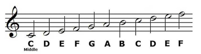 

## Process documentation ##

### Trial one ###
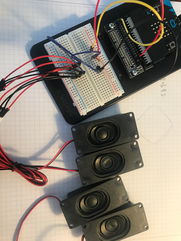
[Trial1 movie]*https://youtu.be/eL1vTo0R4Rk*

I tried connecting four speakers, unfortunately ,the overall volume did not change—incorporation with an amplifier is essential.
I research how to attach the amplifier to the microbit. It seemed to do with some soldering work.  It was not realistic for me. So I decided to go with just one stereo speaker. 

And, lots of examination about coding here. I caliculated the amount range to set the "pitch". 
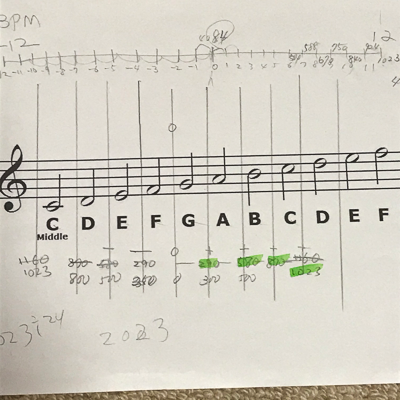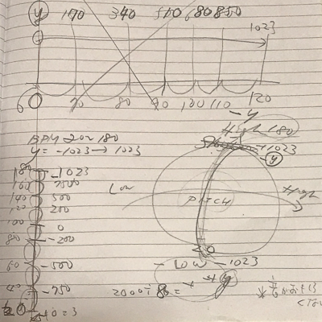
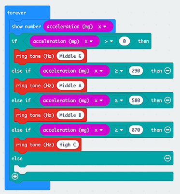 
I coded with "if true" first, but it didn't work well. I was struggling with how to set the range of the amount acceleration. Depend on the setting, microbit picked just one range ..(played just one key..) 

Finally, I have found the codes; "constrain between A and B" and "while do." These worked quite well. Then I played around with the length of the beat. 
Since It cannot stop the sound once it played, it will pick up the "new/next"data at the point where the sound was cut off. So beat length should be the key to the music. 
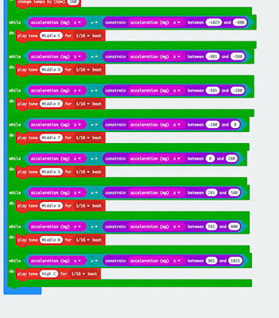
 

### Trial 2 ###
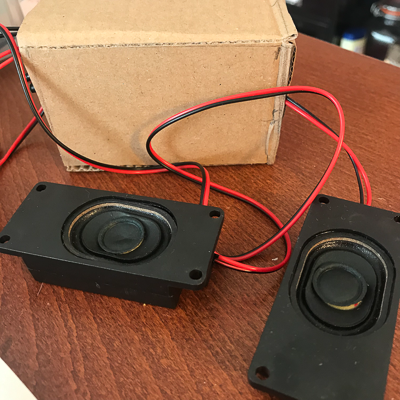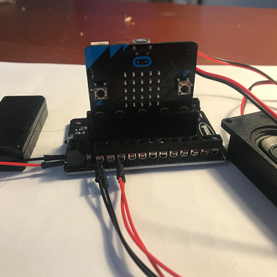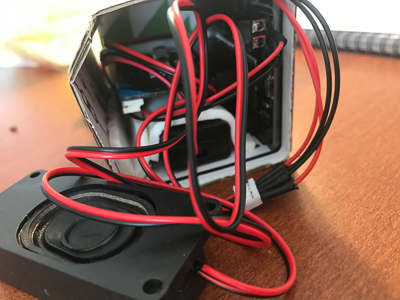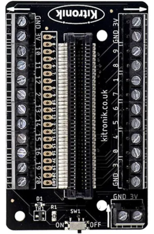
https://youtu.be/yqaLaYlwkn0
https://youtu.be/TvU-jmjDYY4

This stage was the learning about "the Kitronik Terminal Block Breakout" This is because that,  it must withstand to big and constant movement.All parts of the electrical circuit should be firmly connected.  Aligator clip might not work.. 
I confirm the speaker and battery connection with terminal block. Then I put this element in the roughly-made cardboard box. I came up with the idea of putting this container in a cloth bag. It worked! 
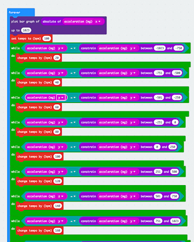 
I tried to set up "acceralation y " as BPM. 

### Trial 3 ###

This stage is trial for the fabrication. I designed the container which could hold the parts( terminal board, battery, microbit, stereo speakers, and cables) firmly in the box. These were set up nicely in the box( bit busy though), 
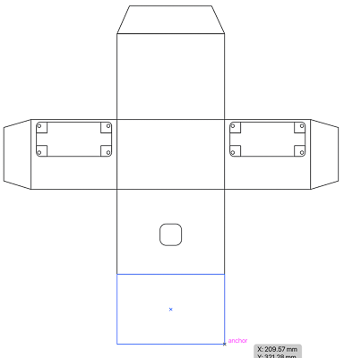
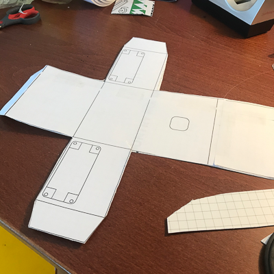 
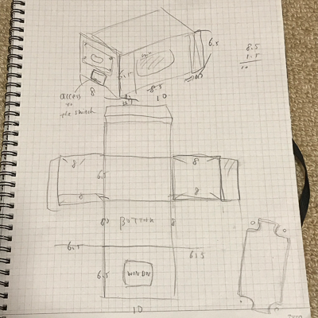
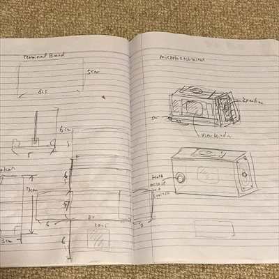
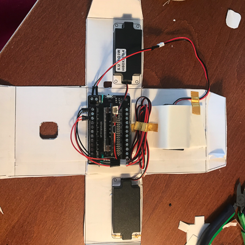 
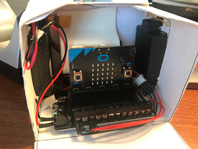  

And I  covered up the ball with my old Tshirt, squeezed the container between the Tshirt and the gym ball. ! it worked! However, the problem was that sound was just too small.. it was not fun at all! 

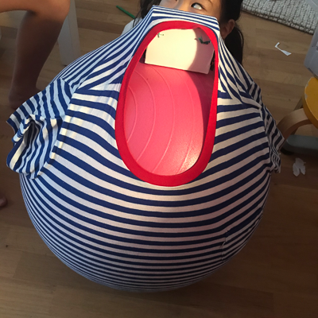 
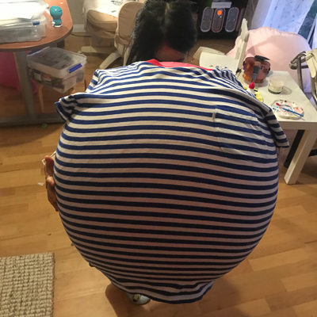  

[trial 3 video] https://youtu.be/lQGHr2OlBq8 

### Trial 4 ###

[Trial 4 video] https://youtu.be/JYrxbIS80yw

This stage is the brushing up the fablication and coding. 
I saw the cover with sewing machine.
 
 
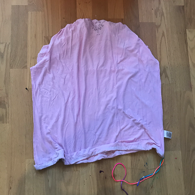 
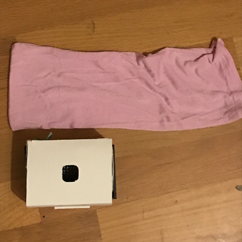 
 
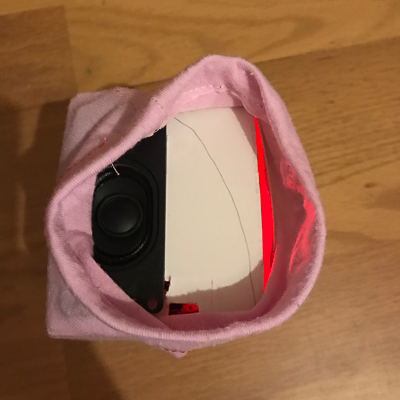

Then, in order to try the LED would work with or not, I tested with fairly light.
It worked well with the direct connection with aligator pin with microbit. 
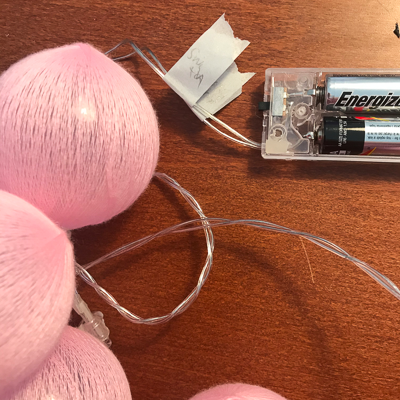 
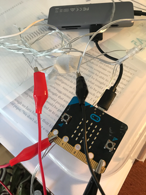 
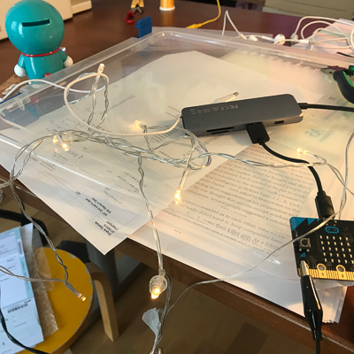  
However, it did not work with terminal block.. So, for this stage I needed to give up.  
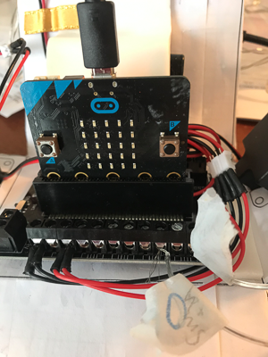 
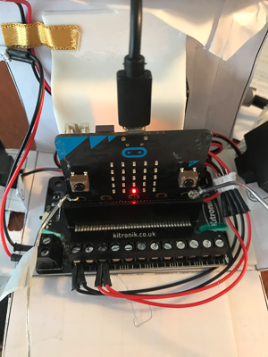  
but I made sure the light could fit into the ball. There is a possibility to put the NEOPIXEL in the ball. 
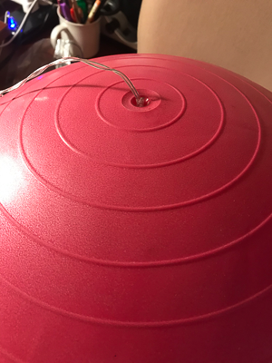 
 
Coding 

Being struggle with making the switch on/off with code, I asked advice during the class time.  Unfortunately, it did not work. For the next stage, I should look at the solution.  
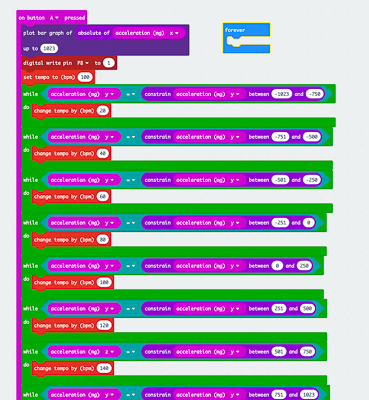 

Then the following is the final code for this prototype.  
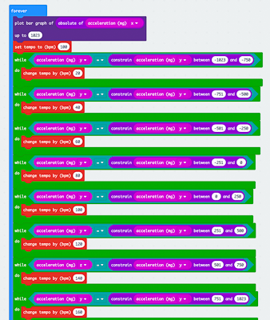 
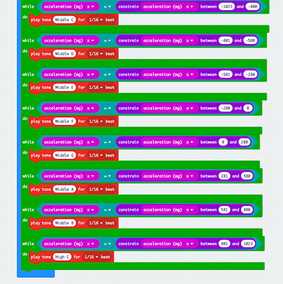  

### FINAL PROTYPE PRODUCTION ###
 
1.
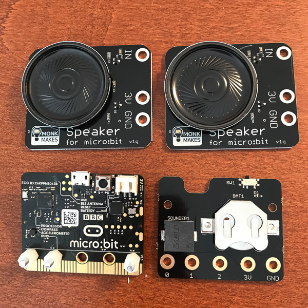
Following the Trial4's outcome, I decided to make the microbit components more small and lighter.
I bought the board with cell battery case ($15) and Monk makes spearker(it work as amplifier)($17). I still wanted to make stereo speaker at this stage . 
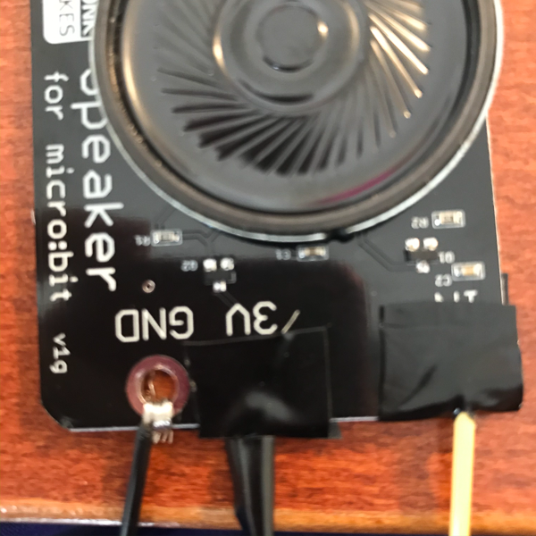 
this is the final setting to the microbit with Insulating tape. 

2
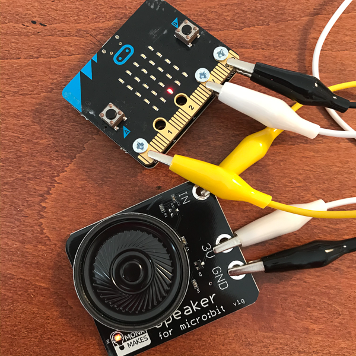
Then, checking how it works. I was satisfied with the volume and sound quality of this speaker.
battery board worked really good as well.. 

3

Checking how 2 speaker works.Again. it was same volume and sound quality when it connect to just one speaker. Moreover, it was not stable connection. So I gave up the stereo speaker system.. 

4
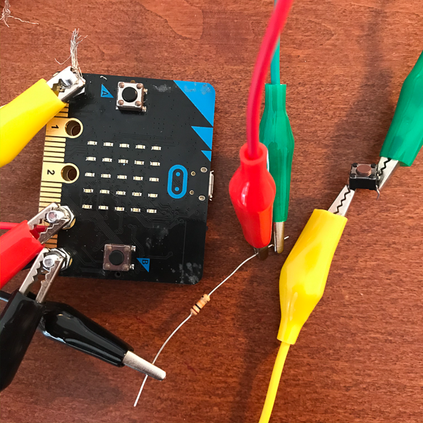(switch2_T.png)
I n order to solve the pending "switch" problem. I tested two switch. unfortunately, i could not achieve the  coding, I guess. It was on while pushing the switch, and its off when release. I needed the switch with just one action. Luckily the cell board was equipped with small slide switch. So I decided to go with that.. 

5
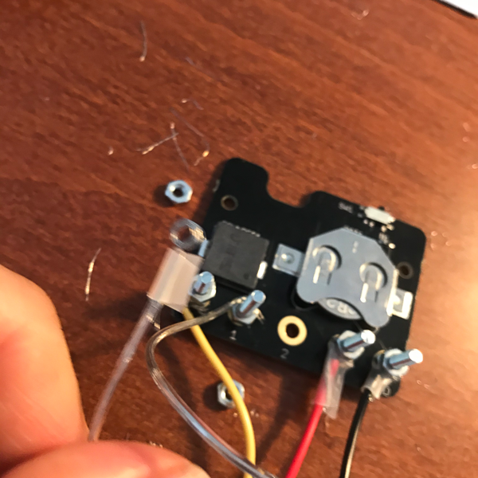
confirm the Kmart LED connection. I tried the digital 2 pin to make the time setting.

6
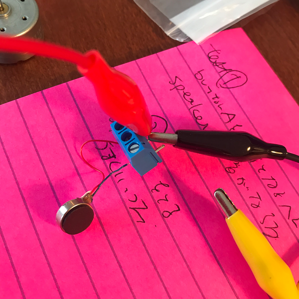(v2.png)(v3.png)(v4.png)
Still made a try to attach the vibration device. It was really fun movement. so I really wanted to put as a feature, I tried the connection via terminal box. but it was not work. I soldered them first time in my life. But it seemd i had to solder on small board. the line was disconected in just 10 seconds later( This was because the vibrator moved too violently. 

7
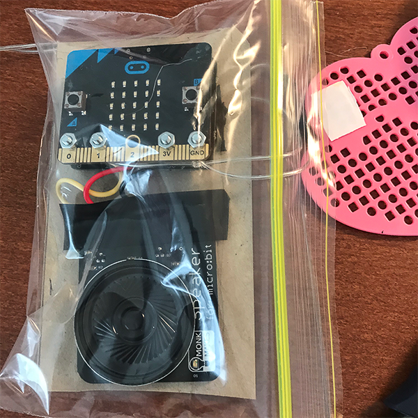(case2.png)
The microbit component were finalized, then it put on to the card board with velcro. Stored in ziplock bag.  

8
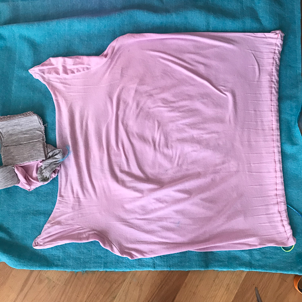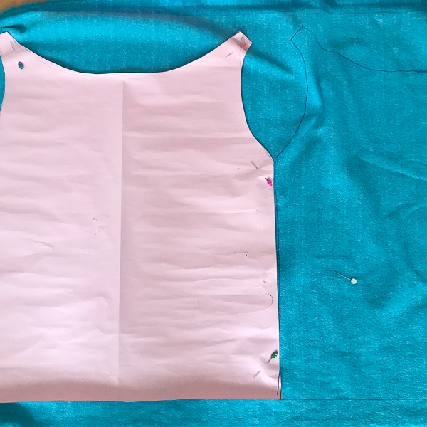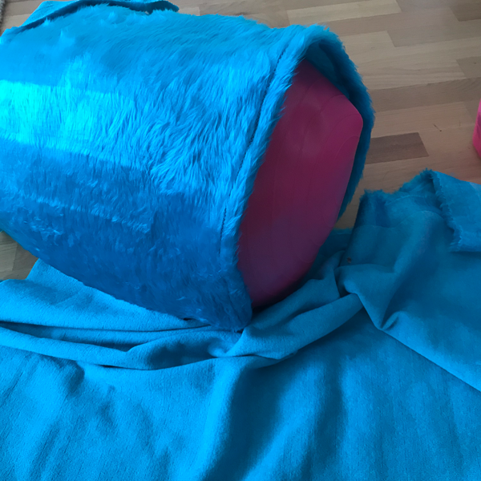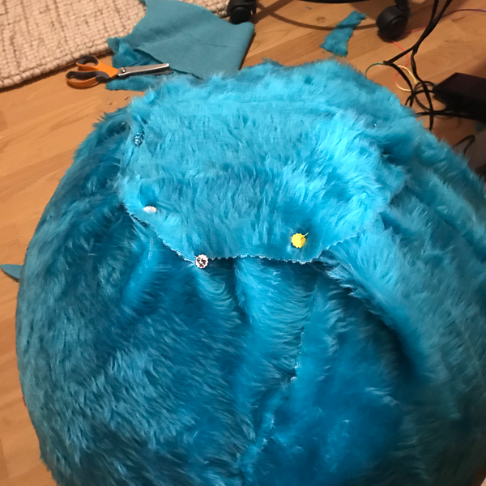
At last, I reached the sewing stage.Opened up the cover of trial 4, then made the paper pattern.  

9.
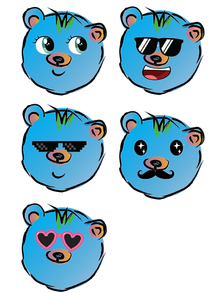
Before making the bear face, I researched around the pattern of bear plushes. to find out the best design for the Ball figure. Then made some sketches. 

10.
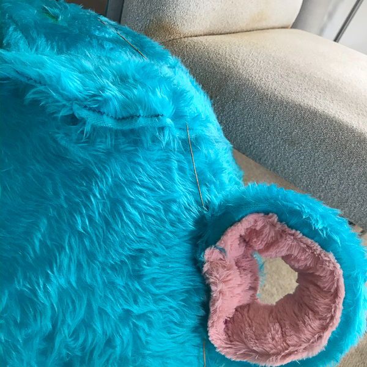(nose.png)
Made years and nose parts. 

11.
(iron2.png)(iron4.png)(eyetest.png)
Printed the eyeparts on Tshirt printing paper, and Ironing on the felt. sadly, the color was faded out.. then painted and detouched  with parmanet marker.. Then put them on the bear to check out which one is the best and looked adorable. I asked my family member their favorite. and decided to go with this simple one. 

12.

Final touch around the microbit case. Atttach the velcro on the case pocket, Tied up LED .
The LED went underneath the bear cover then  inserted in the see-through eye-pouch. 

13.

I check the handle position.. It needed to moved forward.. so I sew them again.. 

14.

Atacched the hair and eyes on! DONE!!! 

## Final code ##
 
  
<!--- Include here screenshots of the final code you used in the project if it is done with block coding. If you have used javascript, micropython, C, or other code, include it as text formatted as code using a series of three backticks ` before and after the code block. See https://guides.github.com/features/mastering-markdown/ for more information about that formatting. --->

## Design process discussion ##
*DISCOVER:
The initial stage, I tried to figure out what I could achieve to the maximum in this COVID19 situation; luck or materials and parts, limited chance to ask onsite technical help. Therefore, as a start,  I decided to explore the material and something "interesting " in the house.
And I checked out several online shops to check out the stock and delivery time range. In general, they do "next business day delivery", however, now it was going to take around 10 days. I found out the timeline and preparation are essential. 

DEFINE:
As the conversation with the teacher, classmate, and tutor through the discussion board and the online class. Then, I conducted researching more further on their feedbacks. This process hugely contributed to decision making.

DEVELOP
Once I decided on the product., I conducted researching material, coding, electrical circuit development, etc. The most disappointing thing is that I have minimal knowledge of electronics and coding. I wish I could have more time to learn these basics. 

DELIVER
I did four trials so far. Throughout the trials, I always find the improvement points. The product is brushed up little by little.  I have been back and forth, endlessly  "Develop"  and "Deliver" stages.

## Reflection ##

What techniques, approaches, skills, or information did you find useful from other sources (such as the related projects you identified earlier)?

Coding resources in the web resources were useful to find out how to  the valuables and the swicthes. Soldering skill is very interesting to me because it will bring enoumous posibility to my project. But I need more time to learn it.

What parts of your project do you feel are novel? This is IMPORTANT to help justify a key component of the assessment rubric.

I think my project is novel in many ways.  there is no kind music instrument like this to learn the tones in fun ways.  it is epoch-making that you can get the upper and lower pitches according to your body position. Also, as a gym ball, it encourages  cheers the exercise by music. Unfortunately Microbit can not store the musicdata, but it is great if I could put the data in.
Also, I have not seen the gym ball like with adorable feature.

What might be an interesting extension of this project? In what other contexts might this project be used? --->

For futute, the gym ball movement can link to the big screen or TV etc, Buddy B can travel anywhere in Google street Map, or in Facetime etc. Also the system will allow to connect the other Buddy B on the network. So they can have a exercise party anywhere in the world!
